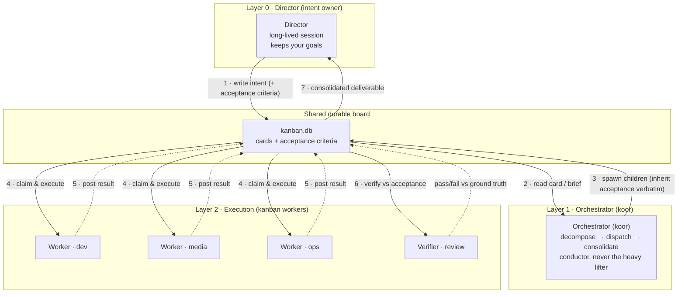
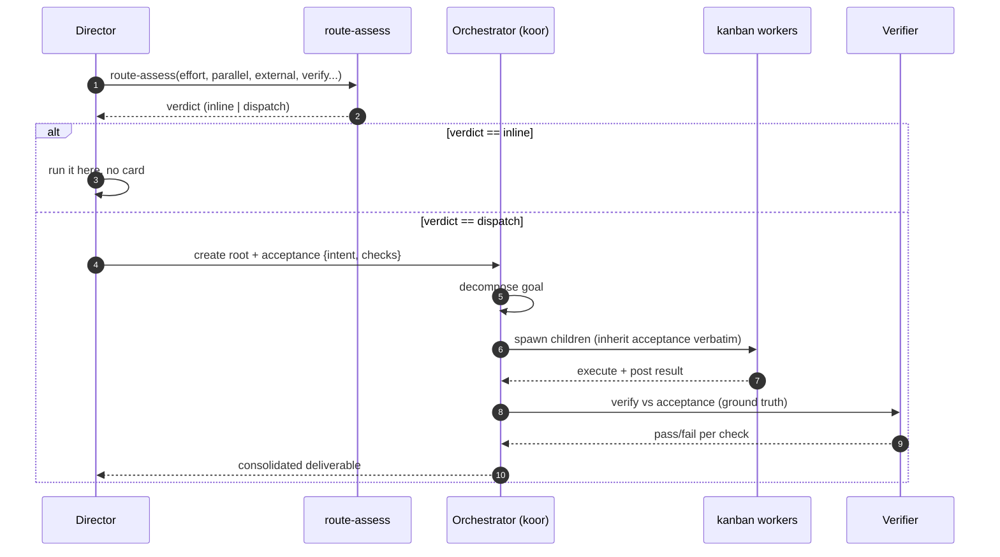

# Architecture & process

> Diagrams are written in [Mermaid](https://mermaid.js.org/) — text that renders natively on GitHub and cannot garble labels. `assets/architecture.svg`/`.png` are the static visualisations.

## Architecture (logical layers)



### Why these layers exist

- **Director** stays interactive. It owns your goals and never blocks inside a running job.
- **Orchestrator** buys parallelism and isolation: decomposes a goal, spawns specialist workers, monitors, consolidates.
- **Workers** are disposable, isolated, single-purpose executors that each claim one card.
- **Verifier** is split from execution so a deliverable is confirmed against ground truth, not the worker's self-report.
- The **board** is the durable handoff point so nothing depends on a live process being awake.

## The failure mode this prevents

A card's `body` is free for an orchestrator to rewrite; each rewrite is a chance for intent to drift. **Ground-truth acceptance propagation** changes this — the original `intent` + machine-checkable `checks` travel in an immutable `acceptance` field that children inherit **verbatim**. The verifier checks against that original, never a re-summarized version.

## Process (the intended flow)



## Decision rule (the cheap-inline tripwire)

| Signal | Consult flag | Hit → route as |
|--------|--------------|----------------|
| decomposes into >1 independent stream | `--parallel-splits N` | `dispatch` |
| external / slow dependency (GPU, render, download, API) | `--external-slow` | `dispatch` |
| needs independent review | `--needs-verification` | `dispatch` |
| needs isolated worktree / tenant / profile | `--requires-isolation` | `dispatch` |
| needs durable persistence / audit | `--needs-durability` | `dispatch` |
| effort over inline budget (default 5 min) | `--effort-minutes N` | `dispatch` |
| none of the above | — | `inline` (do it yourself) |

The tripwire is **conservative on unknown** for the dangerous cases (unknown external dependency or verification need defaults to `dispatch`). Only unknown *effort* defaults to inline. It is **advisory but never ignored silently** — overriding it is a deliberate, recorded choice.

## Acceptance contract

```json
{"intent": "the original goal, written once, verbatim", "checks": ["each machine-checkable criterion"]}
```

- `intent` **required** (non-empty) — the anti-drift anchor.
- `checks` explicit list an independent verifier could confirm.
- `source` auto-set (`director` on creation, parent id on inheritance); do not hand-set.
- Explicit child acceptance **overrides** inheritance; absent everywhere = no ground truth (never crashes).

See `kanban-ground-truth-orchestration/SKILL.md` for full CLI usage.
